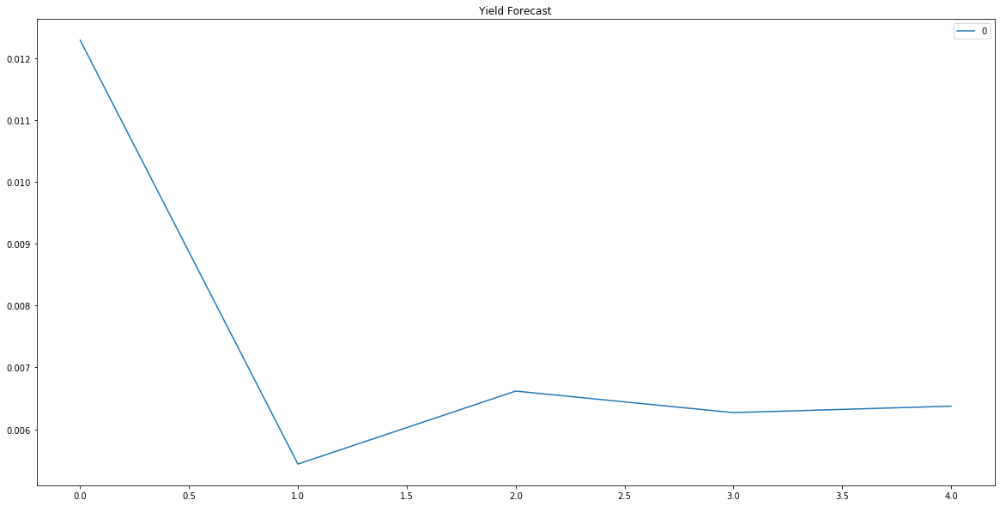
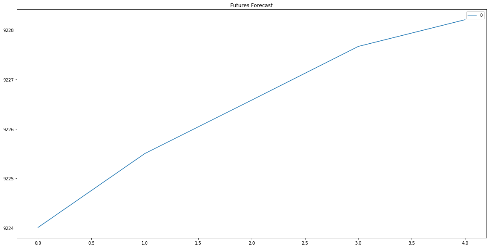
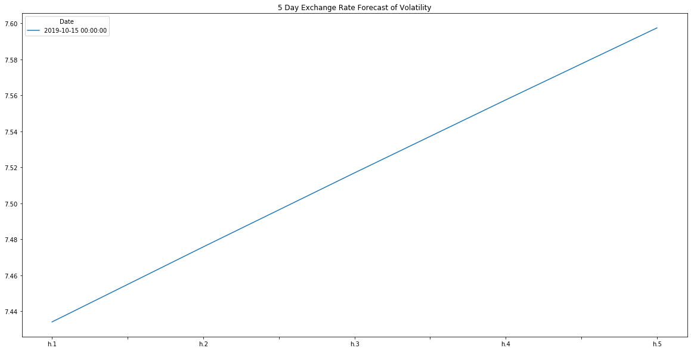

# A-Yen-for-the-Future
## Time Series Forecasting and Linear Regression Modeling

This analysis uses ARMA, ARIMA, GARCH and Scikit-Learn to answer the following questions about the Yen pricing against the US Dollar:

1. Based on your time series analysis, would you buy the yen now?
2. Is the risk of the yen expected to increase or decrease?
3. Based on the model evaluation, would you feel confident in using these models for trading?
4. Does this model (Scikit-Learn) perform better or worse on out-of-sample data compared to in-sample data?

## Time Series Analysis

### ARMA

* ARMA 5 day forecast

* Based on the ARMA model I would buying the Yen today, but I would rerun the prediction the next day since the yeild is forecast to decrease the next day and the GARCH model is forecasting increased volatility.

* Based on the AIC, BIC and p value, the ARMA is a better fit than the ARIMA. The P value is less than .5 and the AIC and BIC of the ARMA is a fifth of the ARIMA's AIC and BIC.

### ARIMA

* ARIMA 5 day forecast

* The ARIMA forecast for the Yen is steadily increaseing value which matches the ARMA's flat yield after day one. 

* Based on this model I would also buy the Yen, but based on the AIC and BIC scores this model does not look to be a good fit.

### GARCH

* Volatility Forecasting

* Based on the GARCH model, the volatility is steadily increasing

### Conclusions

* I would feel more confident using the ARMA model, but both models forecast a buy is better today, than in the next 5 days. If the market has not opened yet, I would looking at other models.

## Regression Analysis

* First 20 Actual Returns vs Predicted Returns

* Visually the Scikit_Learn linear regression model does not look usable. The frist spike is predicted to be a dip.

* The Scikit-Learn linear regression model perform better on out-of-sample data compared to in-sample data.

* The Out-of-sample RMSE (0.4152) is less than the In-sample RMSE (0.5659), therefore I beleive this model is not a good fit for this data set. Both numbers are less than 1, but the Returns and Predicted Returns are on a -1 to 1 scale therefore the numbers are not as low as they seem.
